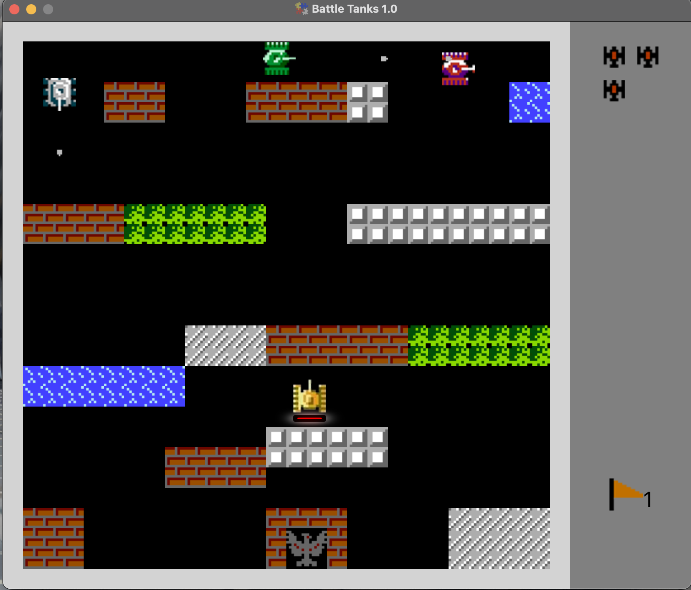

# A FXGL GAME Project - Battle Tanks

## Description
This project is an action-packed, 2D tank combat game developed using the FXGL(JavaFX Game Library) framework.

## Technologies Used
- Java (JDK 22)
- Maven
- FXGL Framework (version 21.1)
- JavaFX (version 22.0.1)

### Key Features include:

- Top-down 2D tank combat gameplay
- Diverse terrain interactions:
    - Tanks can move freely in all directions (up, down, left, right)
    - Navigate through grass for potential cover
    - Strategically use brick walls and indestructible steel walls as obstacles
- Objective-based missions:
    - Defend your flag (base) from enemy attacks
    - Destroy enemy tanks to progress
    - Game over if your flag is captured
- Progressive level design with increasing challenges

## Prerequisites
- Java JDK 11 or higher
- Maven (for dependency management)
- FXGL library (version 17.2 or higher)  

## How to play
- Use WASD to move your tank in all directions
- Use SPACE to fire the enemy tanks
- Navigate through grass for cover
- Use brick walls for protection, but remember they can be destroyed
- Steel walls are impenetrable - use them strategically
- Protect your flag at all costs - if it's captured, the game is over
- Destroy all enemy tanks to complete each level

